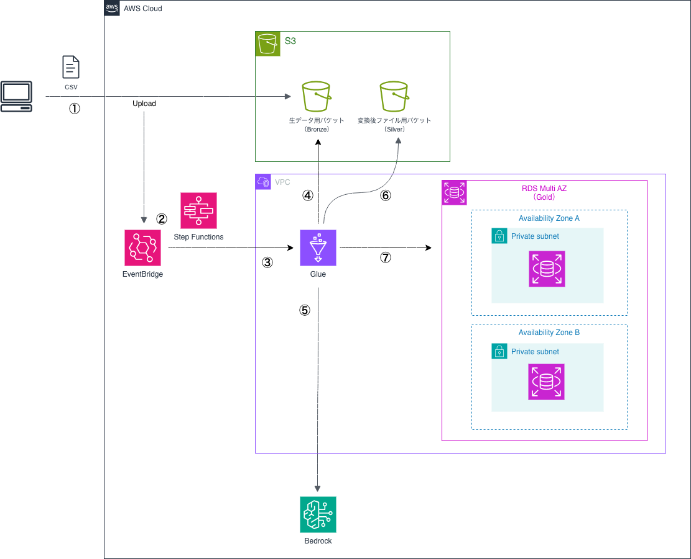

# glue-app

## 概要
このプロジェクトは、AWS GlueとAI機能（具体的にはAWS Bedrock）を統合したデータ分析プラットフォームのポートフォリオです。

## アーキテクチャ
- **インフラストラクチャ**: Terraformで管理 (`infra/`)
- **ETLジョブ**: AWS Glueスクリプト (`src/`)
- **AI統合**: boto3を使用してAWS Bedrockと対話し、高度なデータ処理を行います。

## 構成図

[構成図 (Draw.io)](diagrams/glue-app.drawio)

## ディレクトリ構成
- `diagrams/`: アーキテクチャ図
- `infra/`: Terraform設定ファイル
- `src/`: GlueジョブおよびLambda関数のソースコード
- `data/`: サンプルデータ
- `tests/`: ユニットテストおよび統合テスト
- `docs/adr/`: アーキテクチャ決定記録 (ADR)
